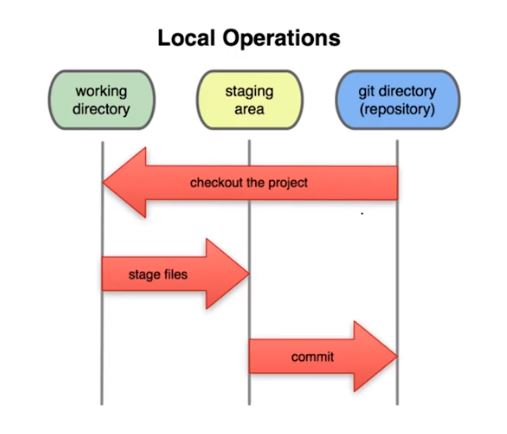
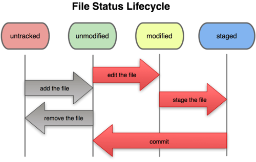

## <ins>Three-stage Architecture in git</ins>

## We have 3 areas in the Three-stage Architecture:

- ##### **Working Directory:**
    

The working directory is the folder in your local computer where the project files and folders are stored.

- ##### **Staging Area:**
    

The staging area has those files that are supposed to go to the next commit. Only those files which are needed to go to the next commit stay in the staging area. Like, suppose you are working on that previous project and you have upgraded the index.html file but somehow you broke the engine.js file, so now you will just add the index.html file to the stage area so it can be added to the next commit and the engine.js will be used from a previous version. And as you have not staged the broken engine.js file, the broken fill will not be committed.

- ##### **Git Repository:**
    

Git repo is a hidden file named .git. It stores all the commits and compresses them. So when you need a specific commit it can present that to you

## <ins>**File status life cycle**</ins>

## **Staged**

Staged means that you have marked a modified file in its current version to go into your next commit snapshot.

## **Commit**

***It is used to record the changes in the repository*.**